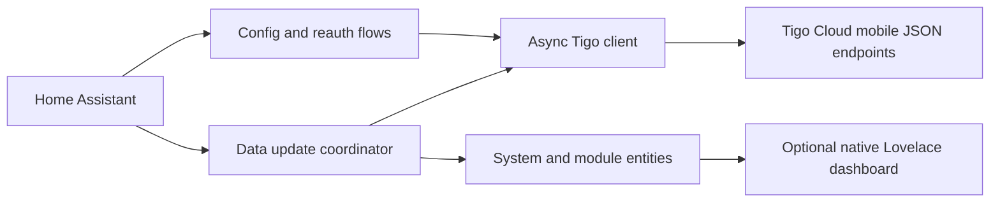

# Architecture

This document describes the intended and tested architecture of Tigo Energy
Cloud v0.1. The integration is read-only and has a deliberately narrow boundary
around Tigo's unofficial mobile endpoints.

## System shape

The integration runs inside Home Assistant and uses Home Assistant's shared
`aiohttp` client session. It has no polling proxy, hosted backend, browser
automation, HTML scraper, local CCA transport, or control path.

## Responsibilities

### Configuration flow

The configuration flow authenticates, discovers systems, lets the user choose a
system when necessary, and assigns the Tigo system ID as the config entry's
stable unique ID. The same flow handles invalid credentials, connectivity
failures, duplicate systems, and reauthentication.

Options constrain the requested daylight polling interval to 2–60 minutes. The
coordinator applies a reduced nighttime cadence so static overnight data does
not create unnecessary cloud traffic.

### API boundary

The asynchronous client owns all endpoint-specific details:

- authentication and in-memory bearer-token lifetime;
- mobile-client request headers;
- URL/query construction and response validation;
- ETag capture and conditional requests in a bounded, dated-response-aware
  in-memory cache;
- a single re-login after an unauthorized response;
- `Retry-After` handling with non-finite rejection and a six-hour maximum
  transient-error backoff;
- conversion of endpoint payloads to internal typed records.

No Home Assistant entity parses raw JSON. Keeping that work at one boundary
makes an upstream mobile-endpoint change easier to diagnose and contain.

The account password remains in Home Assistant's config-entry storage because
the service requires it to establish a new session. Bearer tokens and CCA
request identifiers remain in memory. Neither belongs in logs, diagnostics,
exceptions, or entity attributes.

### Coordinator

One coordinator per configured system owns polling and the coherent data
snapshot consumed by every entity.

- Topology is loaded at setup and refreshed no more than once every 24 hours.
- Dynamic requests retrieve the homepage totals, aggregate power/energy, and
  module samples from every CCA recorded in the topology.
- Conditional requests reuse the last accepted value after HTTP `304`.
- A failed request does not erase the last valid sample; connectivity and
  sample freshness continue advancing independently so an outage cannot freeze
  a previously fresh age/status value.
- Source timestamps, rather than Home Assistant fetch time, drive freshness.
- Daylight/night behavior uses system timezone and Tigo sunrise/sunset data when
  available, with a safe fallback when solar-time metadata is absent.

The client retries authentication only once for a request. Repeated
authentication failures enter Home Assistant's reauthentication flow rather
than looping against Tigo.

### Entities and devices

The system is the top-level Home Assistant device. Module devices attach to that
system and carry stable identifiers based on Tigo object IDs. Inverter and
string metadata organize modules without making entity IDs part of the public
contract.

System totals use the authoritative values provided by the Tigo homepage
endpoint. Module-derived power uses the newest valid sample for each module, not
the final row of a dataset and not a single global timestamp. Multi-CCA systems
merge those independent results by object ID and sample timestamp. A topology
refresh adds entities for newly discovered module IDs and updates integration-
owned display metadata without deleting registry history for removed modules.

See [DATA_MODEL.md](DATA_MODEL.md) for entity semantics and missing-data rules.

## Endpoint behavior used by v0.1

The Basic-account implementation relies on the same JSON service family used by
the Tigo mobile application:

- login and account system discovery;
- system layout/equipment topology;
- homepage production totals;
- module power summary;
- module daily aggregate energy;
- aggregate power for the current-day peak.

These are not a documented compatibility contract. All endpoint names,
headers, and payload decoding stay private to the client module. Consumers must
use the internal normalized models, never raw dictionaries.

The paid official API is not used as a hidden fallback. Local CCA/RS-485 and
HTML scraping are out of scope.

## Update and error model

The integration distinguishes three concepts:

1. **Fetch health** — whether the most recent cloud request completed.
2. **Sample time** — when Tigo says the production data was measured/published.
3. **Entity value** — the last valid normalized value, which may be unavailable
   independently for a particular module.

A connected API can return an old sample, and one missing module does not make
the whole system disconnected. During daylight, sample age beyond 45 minutes
sets the stale-data problem state. Nighttime data does not become stale merely
because solar production has stopped.

Expected transient cases include HTTP `304`, `429`, and `503`, network timeouts,
one unauthorized response during token expiry, missing module fields, and
topology changes. Structural payload changes are treated as integration errors
and surfaced without dumping the raw response.

## Dashboard boundary

The optional dashboard is deployment tooling, not a frontend platform embedded
in the integration. It discovers integration devices/entities through Home
Assistant registries, generates native Lovelace configuration, takes a private
backup, writes transactionally, validates a read-back, and rolls back after a
failed deployment.

It does not alter the global Energy preferences or install custom cards. See
[DASHBOARD.md](DASHBOARD.md).

## Versioning and compatibility

- Config-entry schema changes require an explicit Home Assistant migration.
- Entity unique IDs are persistent API and must not be changed without a
  migration.
- Endpoint/payload changes may be patched within `0.1.x` while entity semantics
  remain stable.
- Removing or changing an entity meaning requires release notes and an upgrade
  path.
- Stored credentials or tokens must never be added to config-entry diagnostics.

The minimum supported Home Assistant release is 2025.1.0. The manifest, HACS
metadata, CI compatibility matrix, and documented minimum must remain aligned
for every release; live v0.1 acceptance additionally targets Home Assistant
2026.8.3.
